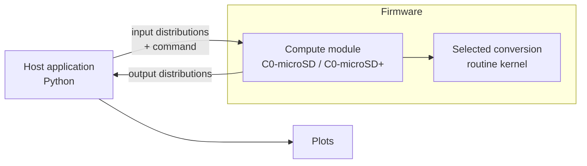

# Signaloid Compute Module Sensor Demo

A demonstration application for the Signaloid C0-microSD and C0-microSD+ compute modules. It runs sensor conversion routines with end-to-end uncertainty quantification directly on the compute module, then plots the resulting output distributions on the host.

Each conversion routine takes sensor readings that carry measurement uncertainty (for example, an ADC voltage known only to within a tolerance) and computes the calibrated physical quantity as a full probability distribution rather than a single number. The computation runs on Signaloid's UxHw technology, which tracks uncertainty through arithmetic without Monte Carlo sampling.

## What this repository contains

This demo has three parts:

1. **Compute module firmware** ([signaloid-soc-application/](signaloid-soc-application/)). A C application that runs on the Signaloid C0 compute module. It waits for a command, reads input distributions from a shared buffer, runs the selected sensor conversion routine, and writes the output distributions back.
2. **Host application** ([python-host-application/](python-host-application/)). A Python program that packs input distributions, issues commands to the module over its block-device interface, reads the results back, and plots them.
3. **Sensor conversion routines** ([submodules/](submodules/)). Several sensor calibration kernels, each maintained in its own repository and included into the firmware at build time.



## Supported sensors

| Command name | Sensor | Measurement | Inputs |
| --- | --- | --- | --- |
| `FLIRAx5` | FLIR Ax5 | Thermal camera temperature | Counts |
| `FlussoFLS110` | Flusso FLS110 | Mass flow, differential pressure | Hxfer, Tflow, T0, Pflow, P0 |
| `NXPMPX4100A` | NXP MPX4100A | Absolute pressure | VsensorADC, VsupplyADC |
| `NXPMPXx6250A` | NXP MPXx6250A | Absolute pressure | VsensorADC, VsupplyADC |
| `SensirionSDP3x` | Sensirion SDP3x | Differential pressure | Aout, Vdd |
| `SensirionSDP8xx` | Sensirion SDP8xx | Differential pressure | Aout, Vdd |
| `SensirionSFM3100` | Sensirion SFM3100 | Gas flow | Uv |
| `SensirionSHT3xARP` | Sensirion SHT3x-ARP | Relative humidity, temperature | Vrh, Vt, Vsupply |
| `SensirionSHT4xI` | Sensirion SHT4xI | Relative humidity, temperature | Vrh, Vt, Vsupply |
| `TexasInstrumentsTMAG5253` | TI TMAG5253 | Magnetic flux density | Vout, Vcc |
| `TexasInstrumentsTMCS112x` | TI TMCS112x | Current | Vout, Vref |

Each routine is documented in detail in its own submodule under [submodules/](submodules/).

## Prerequisites

### Hardware

- A Signaloid **C0-microSD** or **C0-microSD+** compute module connected to your host.
- A card reader or a Signaloid SD-Dev carrier board.

### Software

- Python 3.10 or newer.
- `make`.
- A [Signaloid account](https://get.signaloid.io) and the [Signaloid CLI](https://docs.signaloid.io/docs/api/signaloid-cli/intro/), used to build the firmware in the Signaloid Cloud Developer Platform.

The firmware is compiled in the Signaloid Cloud Developer Platform, not locally. The build targets connect this repository to your account, trigger a cloud build, and download the resulting binary.

## Getting started

### 1. Clone with submodules

The conversion routines and the C0-microSD utilities are Git submodules, so clone recursively:

```sh
git clone --recursive <repository-url>
```

If you already cloned without `--recursive`, pull the submodules in with:

```sh
git submodule update --init --recursive
```

### 2. Select your compute module

Set `DEVICE_TYPE` and `DEVICE` for every `make` command, or edit the defaults at the top of the [Makefile](Makefile).

- `DEVICE_TYPE` is either `SIGNALOID_C0_MICROSD_PLUS` (default) or `SIGNALOID_C0_MICROSD`.
- `DEVICE` is the path to the block device (for example `/dev/disk4` on macOS or `/dev/sda` on Linux). Find it with `diskutil list` on macOS or `lsblk` on Linux.

```sh
export DEVICE_TYPE=SIGNALOID_C0_MICROSD_PLUS
export DEVICE=/dev/disk4
```

### 3. Build and flash the firmware

The default `make` target runs the full connect, build, and download sequence. Flash the downloaded binary to the module:

```sh
make          # connect repo, build in the cloud, download main.bin
make flash    # flash main.bin to the compute module
```

### 4. Run the demo

The `run-all` target creates a Python virtual environment, installs the host application dependencies, and runs every sensor with its default inputs:

```sh
make run-all
```

To run a single sensor, see [Running the host application](#running-the-host-application) below.

## The input value format

Inputs are passed as a value with an uncertainty in the last significant digit, written as `X.Y(Z)`. The host application converts this into a uniform distribution.

For example, `2.5(2)` means the value 2.5 with an uncertainty of 2 in the last digit, which is the uniform distribution over `[2.3, 2.7]`. The value `422500(2500)` is the uniform distribution over `[420000, 425000]`.

## Running the host application

`make run-all` is a convenience wrapper. To run a single conversion, call the host application directly. Use the virtual environment created by the Makefile, or your own Python environment with the dependencies from [requirements.txt](python-host-application/requirements.txt) installed.

```sh
sudo python3 python-host-application/host_application.py <device-path> --variant <variant> <SensorName> <inputs...>
```

Example, running the SHT3x-ARP humidity and temperature conversion:

```sh
sudo python3 python-host-application/host_application.py /dev/disk4 --variant C0-microSD+ SensirionSHT3xARP "2.5(2)" "2.5(2)" "5.1(3)"
```

The default inputs for every sensor are:

```sh
FLIRAx5                     "30050(50)"
FlussoFLS110                "0.03(2)" "293.5(5)" "273.25(25)" "422500(2500)" "402500(2500)"
NXPMPX4100A                 "2.5(2)" "5.1(3)"
NXPMPXx6250A                "2.5(2)" "5.1(3)"
SensirionSDP3x              "1.5(2)" "3.6(3)"
SensirionSDP8xx             "1.5(2)" "3.6(3)"
SensirionSFM3100            "0.75(5)"
SensirionSHT3xARP           "2.5(2)" "2.5(2)" "5.1(3)"
SensirionSHT4xI             "2.5(2)" "2.5(2)" "5.1(3)"
TexasInstrumentsTMAG5253    "2.7(1)" "3.3(1)"
TexasInstrumentsTMCS112x    "3.3(1)" "2.5(1)"
```

`sudo` is required because the host communicates with the module through raw block reads and writes.

See [python-host-application/README.md](python-host-application/README.md) for the full command-line reference, benchmarking options, and output format.

## Configuration

### Selecting which sensors to include

The firmware includes all conversion routines by default. To reduce binary size or build only the sensors you need, edit the `INCLUDE_<Sensor>` flags in [signaloid-soc-application/config.mk](signaloid-soc-application/config.mk). Set a flag to `0` to exclude a routine:

```makefile
INCLUDE_FLIRAx5 = 1
INCLUDE_FlussoFLS110 = 0
```

### Benchmark iterations

The `ITERATIONS` variable controls how many times each conversion kernel runs on the device per command. This is used to measure per-iteration execution time. It defaults to 1.

```sh
make run-all ITERATIONS=100
```

## Makefile targets

| Target | Description |
| --- | --- |
| `make` | Connect the repository, build in the cloud, and download the firmware binary. |
| `make connect` | Connect this repository to the Signaloid Cloud Developer Platform. |
| `make update` | Updates this repository to the latest commit on the already connected repo on the Signaloid Cloud Developer Platform. |
| `make build` | Trigger a cloud build and wait for it to complete. |
| `make download` | Download the firmware binary. |
| `make flash` | Flash the downloaded binary to the module (selects the correct flasher from `DEVICE_TYPE`). |
| `make run-all` | Create the virtual environment and run every sensor with default inputs. |
| `make start` / `make stop` / `make reset` | Start, stop, or reset the Signaloid SoC core (C0-microSD+). |
| `make log` | Stream the device debug log. |
| `make clean` | Remove the downloaded binary and build id. |
| `make clean-all` | Also remove the repository id and cached builds. |

## How it works

The host and the compute module communicate through three regions of the module's block-device interface: a command register, an input buffer, and an output buffer.

**Command register.** A single 32-bit value. The lower 16 bits select the conversion routine (see the command ids in [main.c](signaloid-soc-application/main.c#L79-L93)). The upper 16 bits hold the benchmark iteration count, biased by one so that a value of 0 still runs a single iteration.

**Input buffer.** The host packs each input variable as a pair of single-precision floats giving the low and high bounds of a uniform distribution. The firmware reconstructs each input with `UxHwFloatUniformDist` in [main.c](signaloid-soc-application/main.c#L96-L106).

**Output buffer.** The firmware serializes each output distribution using the Ux-Binary representation. The host reads the output buffer, parses the distribution, and plots it.

The firmware sets a status register through the run: `WaitingForCommand`, `Calculating`, `Done`, or `InvalidCommand`. The host polls this register to know when a result is ready.

## Adding a new conversion routine

1. Add the routine sources under `signaloid-soc-application/conversionRoutines/<Name>/` with a `kernel.c` and `kernel.h`, following the pattern of an existing routine.
2. Add an `INCLUDE_<Name>` block to [config.mk](signaloid-soc-application/config.mk).
3. Add the include guard, command id, and `case` handler in [main.c](signaloid-soc-application/main.c).
4. Add a matching sensor class to [host_application.py](python-host-application/host_application.py) describing its input and output variables and default input ranges.

## Repository layout

```
.
├── Makefile                      Build, flash, and run targets
├── signaloid-soc-application/    Compute module firmware (C)
│   ├── main.c                    Command dispatch and buffer handling
│   ├── config.mk                 Which sensors and sources to build
│   └── conversionRoutines/       Per-sensor kernels included in the firmware
├── python-host-application/      Host application (Python)
│   ├── host_application.py       Sensor definitions, packing, plotting
│   └── run-all-demos.sh          Standalone script to run every demo
└── submodules/                   Conversion routine sources and C0-microSD utilities
```

## Learn more

- [Signaloid Cloud Developer Platform](https://signaloid.io)
- [C0-microSD hardware](https://github.com/signaloid/C0-microSD-hardware)
- [C0-microSD utilities](submodules/C0-microSD-utilities/README.md)
- [Signaloid technology explainers](https://signaloid.com/technology-explainers)

## License

Released under the MIT License. See [LICENSE](LICENSE).
