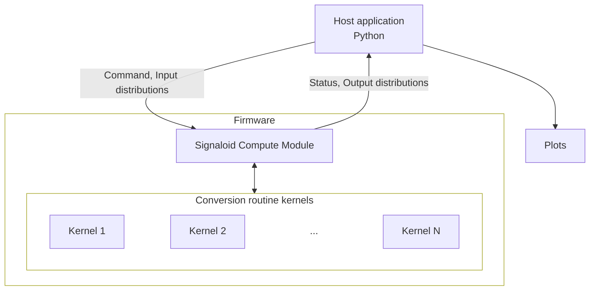

# Signaloid Compute Module Demo Sensor

This is a demo application for the Signaloid compute modules. It runs sensor
conversion routines with end-to-end uncertainty quantification directly on the
compute module, then plots the resulting output distributions on the host.

Each conversion routine takes sensor readings that carry measurement uncertainty
(for example, an ADC voltage known only to within a tolerance) and computes the
calibrated physical quantity as a full probability distribution rather than a
single number. The computation runs on Signaloid's UxHw technology, which tracks
uncertainty through deterministic arithmetic, without Monte Carlo sampling.



## Supported sensors

| Command name               | Sensor              | Measurement                      | Inputs                      |
| -------------------------- | ------------------- | -------------------------------- | --------------------------- |
| `FLIRAx5`                  | FLIR Ax5            | Thermal camera temperature       | Counts                      |
| `FlussoFLS110`             | Flusso FLS110       | Mass flow, differential pressure | Hxfer, Tflow, T0, Pflow, P0 |
| `NXPMPX4100A`              | NXP MPX4100A        | Absolute pressure                | VsensorADC, VsupplyADC      |
| `NXPMPXx6250A`             | NXP MPXx6250A       | Absolute pressure                | VsensorADC, VsupplyADC      |
| `SensirionSDP3x`           | Sensirion SDP3x     | Differential pressure            | Aout, Vdd                   |
| `SensirionSDP8xx`          | Sensirion SDP8xx    | Differential pressure            | Aout, Vdd                   |
| `SensirionSFM3100`         | Sensirion SFM3100   | Gas flow                         | Uv                          |
| `SensirionSHT3xARP`        | Sensirion SHT3x-ARP | Relative humidity, temperature   | Vrh, Vt, Vsupply            |
| `SensirionSHT4xI`          | Sensirion SHT4xI    | Relative humidity, temperature   | Vrh, Vt, Vsupply            |
| `TexasInstrumentsTMAG5253` | TI TMAG5253         | Magnetic flux density            | Vout, Vcc                   |
| `TexasInstrumentsTMCS112x` | TI TMCS112x         | Current                          | Vout, Vref                  |

Each routine is documented in detail in its own submodule under
[submodules/](submodules/).

## Compatibility

This demo currently supports:

- **Signaloid C0-microSD**
- **Signaloid C0-microSD+**
- **Signaloid C0-SD**

## Repository layout

- `signaloid-soc-application/`: A C application that runs on the Signaloid
  compute module.
    - `main.c`: Main application logic. Waits for a command, reads input
      distributions, runs the selected operation, and writes the output
      distributions.
    - `config.mk`: Build configuration, select sources to build.
    - `conversionRoutines/`: Per-sensor kernels included in the firmware.
- `python-host-application/`: A Python application that runs on the host machine
  to interact with the Signaloid compute modules.
    - `host_application.py`: Main application logic. Packs input distributions,
      issues commands, reads and plots the results.
    - `app_helpers.py`: Set of frequently used functions for app building.
    - `run-all-demos.sh`: Standalone script to run every demo.
- `Makefile`: Build, flash, and run targets
- `submodules/`: Project submodules. Signaloid Compute Module Utilities, sensor
  calibration kernels.

## Getting started

### 1. Prerequisites

##### Hardware:

- A supported Signaloid compute module (see [compatibility](#compatibility)) and
  its device path on your host.
- Optionally, a SD-card reader, or the Signaloid SD-Dev carrier board to connect
  the Signaloid compute module to your host machine.

##### Software:

- A [Signaloid account](https://get.signaloid.io).
- A GitHub account connected to your Signaloid account, as shown in the
  [GitHub Login guide](https://docs.signaloid.io/docs/platform/user-interface/repositories/github-login/),
  so you can build the compute module firmware on the
  [Signaloid Cloud Developer Platform](https://signaloid.io). You can also fork
  this demo repository to your own GitHub account, push your changes, and build
  your own version of the firmware.
- A Signaloid API key for authentication.
  [Create one here](https://signaloid.io/settings/api).
- The [Signaloid CLI](https://docs.signaloid.io/docs/api/signaloid-cli/intro/)
  installed and authenticated as shown in its
  [installation](https://docs.signaloid.io/docs/api/signaloid-cli/installation/)
  and
  [authentication](https://docs.signaloid.io/docs/api/signaloid-cli/authentication/)
  documentation.
- Python 3.10 or later for the host application and the flashing toolkit.
- `make`, for running the targets on the top-level `Makefile`.
- Root privileges (`sudo`) for raw block-device access to the compute modules.

### 2. Clone this repository recursively

Clone this repository recursively to get all its submodules:

```sh
git clone --recursive https://github.com/signaloid/Signaloid-Compute-Module-Demo-Sensor.git
```

If you cloned without `--recursive`, pull the submodules in with:

```sh
git submodule update --init --recursive
```

To update all submodules (useful for your own projects):

```sh
git pull --recurse-submodules
git submodule update --remote --recursive
```

### 3. Configure the top-level `Makefile`

1. Configure the `DEVICE` variable. This is the path to the block device your
   compute module is located (e.g. `/dev/disk4` on macOS, `/dev/sda` on Linux).
   Use `diskutil list` on macOS, or `lsblk` on Linux to find it.
2. Configure the `DEVICE_TYPE` variable for your compute module. This is the
   compute module hardware variant you are using. The supported options are:
    - `SIGNALOID_C0_MICROSD`
    - `SIGNALOID_C0_MICROSD_PLUS`
    - `SIGNALOID_C0_SD`.
3. Configure the `CORE_ID` variable matching your compute module type. This
   controls the precision and correlation tracking for your application.
   Default: `C0-*-N` core.

> [!WARNING]
>
> Selecting a wrong block device might **corrupt a real storage device**.
>
> Make sure you have correctly configured the `DEVICE` and `DEVICE_TYPE`
> variables in the `Makefile` as described above.

### 4. Build the Compute Module application

The top-level `Makefile` compiles the Signaloid SoC application on the Signaloid
Cloud Compute Engine using the
[Signaloid CLI](https://docs.signaloid.io/docs/api/signaloid-cli/intro/). It
uses the CLI to connect this repository, start a build in the Signaloid Cloud
Compute Engine, and download the resulting `main.bin` firmware. The build inputs
(source files and include paths) are defined in
`signaloid-soc-application/config.mk`.

The default `make` target connects the repository (first run only), starts a
cloud build, waits for it to finish, and downloads the firmware into
`signaloid-soc-application/<build-id>.main.bin`. To start a build run:

```sh
make
```


### 5. Flash the Compute Module firmware

Flash the downloaded binary to the module. This flashes the
`<build-id>.main.bin` (it builds and downloads it first, if needed).

```sh
make flash
```

> [!NOTE]
>
> If you are targeting a Signaloid C0-microSD, you will be asked to power cycle
> the device to switch modes (`Bootloader`, `Signaloid SoC`). The device will
> have finished flashing when the green LED is solid.

### 6. Run the demo

The `run-all` target of the top-level `Makefile` creates a Python virtual
environment, installs the host application dependencies, and runs the example
commands:

```sh
make run-all
```

To run a single sensor, see [Example command](#example-command) below.

## Host application

The host application interacts with the Signaloid compute modules. It prepares
the input data, sends them to the compute module, issues a command, waits for
the command to finish, and finally fetches the results, printing and plotting
the distributions.

The host application is designed to parse a number of input arguments, each
specifying a uniform distribution, represented in the
[concise form of uncertainty notation](https://physics.nist.gov/cgi-bin/cuu/Info/Constants/definitions.html),
i.e., `X.Y(Z)`.

For example:

- `2.5(2)`: means the value `2.5` with an uncertainty of `2` in the last digit,
  which is the uniform distribution over `[2.3, 2.7]`.
- `2.50(2)`: is the uniform distribution over `[2.48, 2.52]`.
- `422500(2500)`: is the uniform distribution over `[420000, 425000]`.

The distributional input arguments must be quoted in a linux shell.

### Dependencies

To run the Python-based host application you first need to install its
dependencies. To do that:

1. Create a virtual environment: `python3 -m venv .venv`
2. Activate the virtual environment: `source .venv/bin/activate`
3. Navigate to `./python-host-application`
4. Install the requirements: `pip install -r requirements.txt`

You can automate this step by running `make venv` from the top-level `Makefile`.

### Example command

> [!IMPORTANT]
>
> Root privileges are required for raw access to the block device.
>
> We invoke the virtual environment's interpreter directly (`.venv/bin/python3`)
> because a plain `sudo python3` would use the system Python without the
> packages installed in the virtual environment.

> [!NOTE]
>
> Following examples assume a C0-microSD device located at `/dev/disk4`.

Basic command format:

```sh
sudo .venv/bin/python3 python-host-application/host_application.py \
	--device-path <device-path> \
	--variant <variant> \
	<SensorName> <inputs...>
```

Run the SHT3x-ARP humidity and temperature conversion:

```sh
sudo .venv/bin/python3 python-host-application/host_application.py \
	--device-path /dev/disk4 \
	--variant C0-microSD \
	SensirionSHT3xARP "2.5(2)" "2.5(2)" "5.1(3)"
```

The default inputs for every sensor are:

```sh
FLIRAx5                     "30050(50)"
FlussoFLS110                "0.03(2)" "293.5(5)" "273.25(25)" "422500(2500)" "402500(2500)"
NXPMPX4100A                 "2.5(2)" "5.1(3)"
NXPMPXx6250A                "2.5(2)" "5.1(3)"
SensirionSDP3x              "1.5(2)" "3.6(3)"
SensirionSDP8xx             "1.5(2)" "3.6(3)"
SensirionSFM3100            "0.75(5)"
SensirionSHT3xARP           "2.5(2)" "2.5(2)" "5.1(3)"
SensirionSHT4xI             "2.5(2)" "2.5(2)" "5.1(3)"
TexasInstrumentsTMAG5253    "2.7(1)" "3.3(1)"
TexasInstrumentsTMCS112x    "3.3(1)" "2.5(1)"
```

To run all the example commands use the `make run-all` target of the top-level
`Makefile`.

### Usage

```sh
usage: host_application.py [-h] -d DEVICE_PATH [-v {C0-microSD,C0-microSD+,C0-SD}] [-r] [-s] [--skip-printing-results] [--skip-plotting-results] [--benchmark] [--iterations ITERATIONS] command ...

Host application for the Signaloid C0 compute modules sensor conversion routine demo

positional arguments:
  command               {
                                FLIRAx5,
                                FlussoFLS110,
                                NXPMPX4100A,
                                NXPMPXx6250A,
                                SensirionSDP3x,
                                SensirionSDP8xx,
                                SensirionSFM3100,
                                SensirionSHT3xARP,
                                SensirionSHT4xI,
                                SensirionSLS1500,
                                TexasInstrumentsTMAG5253,
                                TexasInstrumentsTMAG618x,
                                TexasInstrumentsTMCS112x
                        }

options:
  -h, --help            show this help message and exit
  -d, --device-path DEVICE_PATH
                        Path of the C0 compute module device (e.g., /dev/disk4)
  -v, --variant {C0-microSD,C0-microSD+,C0-SD}
                        Hardware variant (default: C0-microSD+)
  -r, --reset-on-launch
                        Reset the core on launch. Ignored on the C0-microSD.
  -s, --stop-on-exit    Stop the core on exit. Ignored on the C0-microSD.
  --skip-printing-results
                        Skip printing the resulting Ux-Strings. Useful when benchmarking.
  --skip-plotting-results
                        Skip plotting the resulting Ux-Strings. Useful when benchmarking.
  --benchmark           Enable benchmarking mode. Measures and reports the per-iteration
                        device execution time from command issue until status=Done.
  --iterations ITERATIONS
                        Number of times the conversion kernel is repeated on the device
                        for a single command. The value is encoded as (iterations - 1)
                        in the upper 16 bits of the command register. Default: 20
```

## Signaloid SoC application

The Signaloid SoC application runs on the core of the Signaloid compute module's
SoC. This is where the arbitrary probability distribution arithmetic is
processed.

The compute module continuously polls the command register to start processing a
new command. When a new command arrives, it parses the input buffer for the
needed input data of that specific command, it runs the computation, and finally
packs the results to the output buffer, signaling a successful computation
finish on the status register.

### How it works

The host and the compute module communicate through four regions of the module's
block-device interface: a command register, an input buffer, an output buffer,
and a status register.

**Command register.** A single 32-bit value. The lower 16 bits select the
conversion routine (see the command ids in
[main.c](signaloid-soc-application/main.c)). The upper 16 bits hold the
benchmark iteration count, biased by one so that a value of 0 still runs a
single iteration.

**Input buffer.** The host packs each input variable as a pair of
single-precision floats giving the low and high bounds of a uniform
distribution. The firmware reconstructs each input with `UxHwFloatUniformDist`
in [main.c](signaloid-soc-application/main.c).

**Output buffer.** The firmware packs the resulting distributions using
`UxHwFloatDistributionToByteArray` into the output buffer. The host reads the
output buffer, parses the results, plots the distributions, and prints their
particle values.

**Status register.** The firmware sets a status register through the run:
`WaitingForCommand`, `Calculating`, `Done`, or `InvalidCommand`. The host polls
this register to know when a result is ready.

### Selecting which sensors to include

The firmware includes all conversion routines by default. To reduce binary size
or build only the sensors you need, edit the `INCLUDE_<Sensor>` flags in
[signaloid-soc-application/config.mk](signaloid-soc-application/config.mk). Set
a flag to `0` to exclude a routine:

```makefile
INCLUDE_FLIRAx5 = 1
INCLUDE_FlussoFLS110 = 0
```

## Makefile targets

| Target           | Description                                                                                                           |
| ---------------- | --------------------------------------------------------------------------------------------------------------------- |
| `make`           | Connect the repository, build in the cloud, and download the firmware binary.                                         |
| `make connect`   | Connect this repository to the Signaloid Cloud Developer Platform.                                                    |
| `make update`    | Updates this repository to the latest commit on the already connected repo on the Signaloid Cloud Developer Platform. |
| `make build`     | Trigger a cloud build and wait for it to complete.                                                                    |
| `make download`  | Download the firmware binary.                                                                                         |
| `make flash`     | Flash the downloaded binary to the module (selects the correct flasher from `DEVICE_TYPE`).                           |
| `make run-all`   | Run every sensor with default inputs. Creates the needed Python virtual environment if needed.                        |
| `make run-all`   | Run every sensor with default inputs in benchmark mode. Creates the needed Python virtual environment if needed.      |
| `make start`     | Start the Signaloid SoC core (on supported compute modules).                                                          |
| `make stop`      | Stop the Signaloid SoC core (on supported compute modules).                                                           |
| `make reset`     | Reset the Signaloid SoC core (on supported compute modules).                                                          |
| `make log`       | Stream the device debug log.                                                                                          |
| `make venv`      | Create the virtual environment needed for running the host application.                                               |
| `make clean`     | Remove the downloaded binary and build id.                                                                            |
| `make clean-all` | Also remove the repository id and cached builds.                                                                      |

### Benchmarking

The `ITERATIONS` variable controls how many times each conversion kernel runs on
the device per command. This is used to measure per-iteration execution time. It
defaults to 20.

```sh
make bench-all ITERATIONS=100
```

## Adding a new conversion routine

1. Add the routine sources under
   `signaloid-soc-application/conversionRoutines/<Name>/` with a `kernel.c` and
   `kernel.h`, following the pattern of an existing routine.
2. Add an `INCLUDE_<Name>` block to
   [config.mk](signaloid-soc-application/config.mk).
3. Add the include guard, command id, and `case` handler in
   [main.c](signaloid-soc-application/main.c).
4. Add a matching sensor class to
   [host_application.py](python-host-application/host_application.py) describing
   its input and output variables and default input ranges.

## Learn more

- [Signaloid Cloud Developer Platform](https://signaloid.io)
- [Signaloid Compute Modules Documentation](https://docs.signaloid.io/docs/compute-modules/)
- [Signaloid Compute Module Utilities](submodules/Signaloid-Compute-Module-Utilities/README.md)
- [Signaloid Technology Explainers](https://signaloid.com/technology-explainers)

## License

Released under the MIT License. See [LICENSE](LICENSE).
